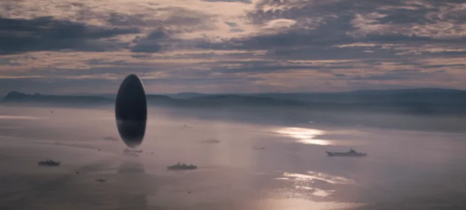
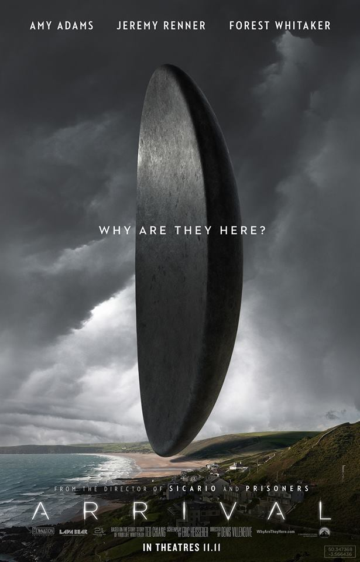
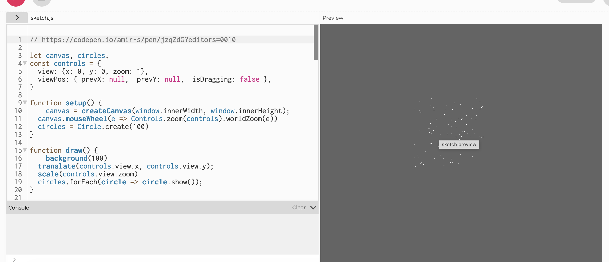

# quiz-8

## 1.Imaging Technique Inspiration

My inspiration comes from the cinematic visual technique used in the movie *Arrival*, specifically the extreme scale contrast between "Big Dumb Objects" (BDO) and human elements. The film masterfully creates a sublime and oppressive atmosphere by juxtaposing a massive, static (or incredibly slow-moving) monolithic presence against tiny, dynamic, and active subjects. 

I want to incorporate this specific aesthetic technique—contrasting massive static forms with microscopic dynamic interactions—into my project. It is a highly beneficial approach because it elevates the project from a simple technical exercise to a piece of generative art that evokes a strong emotional atmosphere and narrative tension.

## 2.Coding Technique Exploration

To implement the scale contrast from Part 1, I will explore camera manipulation and zooming techniques. By utilizing transformation functions such as `scale()` and `translate()`, I can map mouse interactions (like scrolling) to a zoom parameter. The scene starts tightly focused on tiny, moving elements. As the user zooms out, the canvas gradually reveals the massive, static object occupying the background. This interactive coding technique perfectly executes the narrative reveal of overwhelming scale driven by user interaction.

**Example Implementation Link:**
[Interactive Zoom and Pan in p5.js ](https://editor.p5js.org/Kubi/sketches/36dfCG35j) 